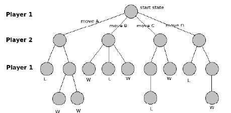

MIT ES.S20 Lecture 1: Game Representation
-------

# Lecture Outline

1. What do we mean by toys and games?

2. Why do we care about this?

3. How do we represent games mathematically?

4. How does searching on game trees work?

5. What happens when you can't see the end?

6. First Game Demonstration

# Toys and Games

+ Examples of toys

> Geometric Puzzles, Rubik's Cube, Sudoku, Kakuro

+ Examples of games

> Chess, Checkers, Go, Backgammon, Dominion, Monopoly

+ Strict Definitions

> To define a game, you need n adversarial players, an exact
> set of rules, and an impartial judge. You don't need turns
> per se -- this is the boundary between combinatorial (turn-
> based) and economic (simultaneous or continuous) games.

> In toys the rules are generally physical and there is usually
> only one player.

+ Recreational Mathematics

> Recreational mathematics is what happens when you take games
> as inspiration for mathematical problems:

> "All mathematics is a recreation" - Conway

# The Point of this Course

+ Games as Problems

> The initial approach is to see a game as nothing more than
> a specific problem to solve: this is somewhat the motivation
> of the pure-mathematical approach. It brings up questions like
> "Why is Go harder than Chess?"; "What happens when this choice
> is random?"; and "Is this even fair?"

+ Games as Cognition

> The way people play games, however, is much less precise: it's
> very much in terms of visual and kinetic processing. In this way,
> if you're trying to think about cognition, specifically machine
> cognition, a game with tight rules is a good place to start.

+ Games as Mental Models

> In a strict mathematical context, games are just complex
> algebraic objects; so they can be used to think about math by
> proxy. Conway's famous example is of mapping the real numbers
> onto the "Surreal Numbers" formed by a simple game; but we
> will think mostly about the Rubik's Cube.

+ Games as Economics

> If you generalize it in that way, much of modern society takes
> the form of a game: stock markets are actually just a set of
> rules in an environment, enforced by the government. Game theory
> is huge business in economics.

+ Games as Security

> What happens when you want to implement your own game? Well, 
> you can do this directly by designing them in code or legalese
> in order to make a desired economy, as in MMOs.

> A very interesting application is applying games to cryptography
> when your rules can be enforced by cryptography, as in
> cryptocurrencies.

# Representation of Games

+ Game States

> Let's take simple, turn-based, complete knowledge games for now;
> and specifically, we'll solve Tic-Tac-Toe. There are many other
> ways to make game solutions, but this is probably the simplest.

> Whatever is on the board we call a "state" and a move by either
> player is an edge between these states (a ply).

+ Game Trees

> We can construct a game tree by connecting the state nodes by
> edges describing the possible moves. In games like tic-tac-toe
> where the players alternate turns, each depth level alternates
> players.



> We call the number of moves that can be made from any given game
> state the branching factor

# Game Searching

+ Minimax Search

> If we want to maximize our performance, then we have to search
> for the maximum performance on our move edges and the minimum
> on our opponent's. With this in mind, if we want to search for
> the move that will maximize our performance, we can recurse
> with the following two functions (in python pseudocode):

```
def max-value(state,depth):
    if (depth == 0):
        return state.value
    v = -float('inf')
    for each s in state.children:
        v = max(v,min-value(s,depth-1))
        return v

def min-value(state,depth):
    if (depth == 0):
        return state.value
    v = -float('inf')
    for each s in state.children:
        v = min(v,max-value(s,depth-1))
        return v
```

> In this code, `v` is the valuation of the position. Take for example
> 1 as a win, 0 as a draw, and -1 as a loss.

> It's instructive to see why we can also use Negamax search, a slight
> variation which uses the property that -min(-a, -b) = max(a, b) to
> combine the two into one function.

```
def negamax(state,depth):
    if (depth == 0):
        return state.value
    v = -float('inf')
    for each s in state.children:
        v = max(v,-negamax(s,depth-1))
        return v
```

+ Iterative Deepening

> Note that Minimax/Negamax goes all the way to the bottom of the tree
> immediately, which will be impossible to do in games like Chess. So,
> what we can do instead is to only go to a certain depth in an
> iterative process.

> Note, however, that this is difficult because you have to know in
> advance how far you're going to go and you have to have an evaluation
> function. We'll talk about how to optimize this sort of procedure when
> we talk about Chess.

+ Heuristic Search

> Maybe raw negamax will solve games like tic-tac-toe, but in games with
> many moves, we need to be able to tell which part of the tree (i.e.
> which states) are better than others. We call this our evaluation function
> or heuristic; and if we have a good one, we can just add it to our
> valuation. If we have a specific goal in mind, this is called A\*.

```
def heurstic_search(state, max_depth):
    if (max_depth == 0 or state.is_end()):
        return evaluate(state)

    v = -float('inf')
    for each s in state.children:
        v = max(v, -heuristic_search(s, max_depth-1))
        return v
```

> If we accept feedback from the success and failure of our heuristic function,
> we can learn a proper heuristic. We'll see this later when we talk about
> artificial intelligence

+ Monte-Carlo Methods

> Once we're in the context of heuristics, we can often say (as is the case in games
> like Go or many probabilistic games like Poker) that there are just too many
> branches and a lot of them look the same. When this happens, randomized strategies
> like Monte-Carlo make a lot of sense:

> The assumption is that simulating play at a random node will be representative
> and we can get a rough idea of the probability of a good outcome by trying
> random continuations. We'll talk more about this when we deal with randomized
> games.

+ Proof Searching

> Another way of thinking about the search methods we've been describing is in the
> context of mathematical proofs: if we let a provable win for us be 1 and a loss
> be 0, we can say that we can win iff OR(all of our moves). Similarly, if it is
> our opponent's turn, they can win iff AND(all of their moves) is 0.

> Clearly, this turns the problem of game searching into a giant boolean circuit
> and is particularly relevant when we start talking about possiblities of winning.
> If we want to attach probabilities of winning to nodes instead of 1 and 0, we
> can use fuzzy logic, but this ends up being just the same as heuristic search.

# Demonstration

+ Strategic Positioning Game

+ Loopy

+ Playing chess?
