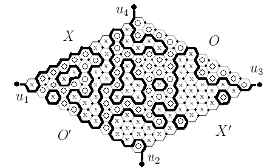
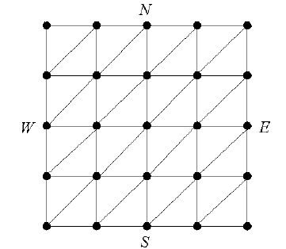

MIT ES.S20 Lecture 2: Classical Combinatorial Game Theory
-------

# Lecture Outline

1. Nim

2. Nimbers

3. Graphical Game Representation

4. Sprouts

5. Hex

7. Demonstrations

# Introduction

+ Combinatorial Games

> We have two players with a finite set of positions, which are fully
> specified by rule-based moves. We alternate turns and we eventually
> reach a win or lose.

+ Impartial Games

> The moves don't depend on which player is moving (i.e. the game is
> _unbiased_, or non-_partisan_). Games like Chess and Go are *not*
> impartial.

# Nim

+ Game Rules

> There are three _nim-heaps_ of stones and each player alternates
> taking any number of stones off of each heap until no stones
> remain.

> In _normal_ scoring, the player to make the last move wins; and
> in _misere_ scoring, the player forced to make the last move
> loses.

```
A B C     Moves

3 4 5     
          I take 2 from A
1 4 5
          You take 3 from C
1 4 2
          I take 1 from B
1 3 2
          You take 1 from B
1 2 2
          I take the last in A
0 2 2
          You take 1 from B
0 1 2
          I take 1 from C
0 1 1
          You take 1 from B
0 0 1
          I take the last C and win
0 0 0
```

+ Game Positions

> Now, let's say that we are in a _P-position_ if it guarantees
> a win for the previous player; and we say the game is in an
> _N-position_ if it guarantees a win for the next player.
> These are relative to the position, as above.

> If we call every terminal position P and then every position from
> which we can only reach a P-position an N position, then induct
> forward, we can label every position.

+ Winning Strategy

> We can make a winning strategy if we can make an _invariant_ such
> that every move we make transitions the game into a P-position.

> To do this, note that every time we transition from P to N in
> backward induction, we change the sign of at least one value in
> the XOR of the values in all three piles (demonstrate XOR). Since
> our goal state is (0,0,0), whose XOR is clearly 0, maintaining
> an XOR of 0 is our invariant!

+ Nimbers

> Now, say that each nimber s of a Nim-state is the net XOR of the 3-tuple
> of the numbers in each pile. Our invariant is that s=0, and each
> move can be represented as some t not equal to 0 which will update
> the state.

 - It is always possible to make the next state's nimber 0 if the current
   nimber is nonzero

+ Poker Nim

> Suppose that we can also add chips to a heap.

+ Nimble

> Put any number of coins on a row of squares, which can be moved left.
> The game ends when all coins are on the far left square.

+ 2D Nim

> The same as Nimble in two dimensions, in which case you can move down
> or left.

# Graphical Games

+ Graph representation of Games

> A game is a graph G = (S, M), where S is the set of legal game states and
> M is the set of move arrows S -> S. The start position is some s0 and each
> player alternately moves along some arrow in M. A player who is unable to
> make a move loses. Assume all paths in G have finite length (_progressively
> bounded_).

+ Sprague-Grundy Functions

> Define a function g on S (the _Sprague-Grundy function_) that takes
> each game state and assigns it the smallest number that is different from
> the number assigned to the states it can move to.

```
g(s) = min({n >= 0 : n != g(b) for each (m : s -> z) in M})
```

> This looks like the min-coloring of the game graph! Note also that in the
> context of N- and P- positions, it obeys the same rules -- i.e. a winning
> strategy is one that moves to the same "color" or Sprague-Grundy number as
> the winning state)

+ Sums on Games

> Using this representation, we can "add" games together by making a graph
> C from graphs A and B such that the states are in Sa x Sb and the moves
> are in Ma x Mb! For example, a game of 3-pile Nim is the sum of 3 1-pile
> games of Nim.

> Note that this means that on each turn we can move in one game or both and
> the maximum number of possible moves is the sum of the maximum number of
> possible numbers in each game.

+ The Sprague-Grundy Theorem

> *The SG function of games on a graph is just the Nim-sum of the SG functions
> of its components*.

# Other Impartial Games

+ Northcott's Game

> Take a checkerboard with one black and one white checker on each row,
> which are moved by their respective players. Players can move any number
> of spaces along each row (without jumping) until one of them can't any more. 

> _This game is not finite and not impartial._

+ 21 Takeaway

> Start with a pile of 21 coins. Each player alternately takes 1-3 coins away
> from the pile. The player that takes the last coin wins.

+ Turning Turtles

> Lay out a row of n coins, randomly on H or T. Each move, you change
> one coin from H to T, and optionally change another on the left of it from
> H to T or T to H.

+ Silver Dollar Game

> Starting with a long row of squares, with coins on some of them, a legal move
> is to move one coin any number of squares left without jumping. The game ends
> when there are no more legal moves. Silver dollars are optional.

+ Green Hackenbush

> Draw one or more connected rooted graphs. On each turn, cut a branch; this
> deletes the branch and any branches that are not connected anymore. The
> player who cuts the last branch wins.

+ Sprouts

> Start with any number of dots on the page. A move connects two dots and makes
> a new dot in the middle of them. The rules are that there cannot be any
> intersections; no edge can have degree more than three; and a curve may
> connect to its origin. The person who draws the last curve wins.

# Hex

+ Game Rules

> Diamond-shaped board of hexagonal cells. Alternate turns moving to unoccupied
> spaces and the first to find a path from one side to the other wins.



+ Lemma: Having extra pieces of your own color cannot hurt you

> Take the additional piece at position x on the board: if x is part of your
> optimal strategy, then you just gain a turn; if x is not, then it should
> not influence your strategy.

+ Lemma: The first player can always win Hex

> Suppose the second player has an optimal strategy; then if he takes the first
> position and simply makes a random move on his first turn, he still wins. If
> hex cannot end in a draw (next theorem), we can therefore always construct
> optimal play for the first player.

+ The Hex Theorem: The game cannot end in a draw

> Assume the board is filled; then mark all edges at an interface between
> opposing colors. This will form some set of closed surfaces and a draw
> implies that there is some marked path from the top of the board to the
> bottom.

> However, if this path exists, then there cannot be a path between the other
> ends. However, this means that the path that starts from them cannot
> terminate because cycles do not make sense in this context. This gives a
> contradiction.

+ The Hex Theorem is equivalent to Brouwer's Fixed Point Theorem

> There is a proof in `simple_games/hex.pdf`, but I didn't think we'd have
> enough time to cover it (it's a bit complex). The primary insight comes
> from changing representations to a lattice (see Figure 2).



# Demonstration

1. Try to find optimal strategies for the other similar games, such as
   Northcott, Silver-Dollar, or higher-dimensional Nim

2. Write a sprouts position and try to convince your partner to play it.

3. Play Hex!

