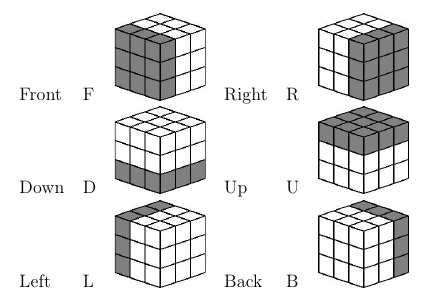
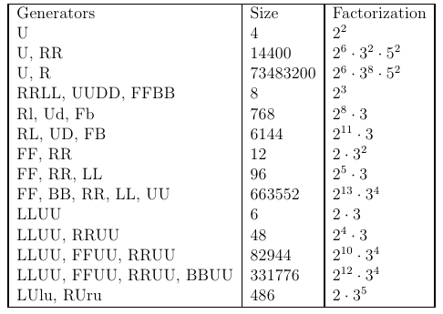

MIT ES.S20 Lecture 3: Algebraic Structures in Games
-------

# Lecture Outline

1. Mathematical Notation of Rubik's Cubes

2. Groups and Subgroups

3. Permutation and Parity

4. Macros

5. Cube Solutions

6. Solution Bounds

7. Complexity of Rubik's Cubes

8. Demonstration

# Mathematical Notation

+ Places on the Cube



> This gives sides notated F(ront), R(ight), B(ack), L(eft),
> U(p), and D(own). This requres that we are looking at the
> cube _relative to the same corner_.

+ Move Functions

> For each side, let the capital function denote a 90-degree
> clockwise turn and the lower-case denote a counterclockwise
> one. Letting I be the identity, we see that
>> I = RRRR = LLLL = rrRR = ...
> The algebraic behavior of these operators on the solved cube
> is what we are going to analyze.

# Groups and Subgroups

+ Groups

> A group G is just a set of states (or elements) and an operation
> (`*`).
>> Closure: for any h and g in G, `h * g` is in G
> 
>> Associative: `(f * g) * h = f * (g * h)`
> 
>> Identities: For some e in G, `e * g = g * e = g`
> 
>> Inverses: For all f in G, there is some g such that
>>  `f * g = g * f = e` 

+ Examples

> Groups are a very common structure: we see it in the integers,
> the rationals, nonsingular matrices, etc. In our demonstrations
> of groups, thinking of matrices (for me, the Quaternions) under
> multiplication will be a useful analogy.

+ Elementary Theorems

>The identity is unique

>If `a * b = e`, then `a = inv(b)`

>If `a * x = b * x`, then `a = b`

>The inverse of `(ab)` is `inv(b)inv(a)`

> `inv(inv(a)) = a`

+ Graphs and Subgroups

> This, however, doesn't give us much insight into what groups actually
> _do_. For that, let's work with a graphical metaphor: we can think of
> `*` as a function taking a pair of elements of G to another element
> of G (`* :: (G,G) -> G`). Then also, we can think of a left-multiplication
> by some element g as a function `(g*) :: G -> G`. This is exactly a 
> graph Q with elements of G as nodes and `(g*)` making the edges.

>> Closure means that all edges in Q have a start and end in Q

>> Identity means that exactly one element e in Q goes to g

>> Inverses mean that exactly one element in Q goes to e

>> Associativity means that the composition of `(f*)` and `(g*)`
>> is the same as `((f*g)*)`.

> If we take the graph where all nodes are connected to the identity, we
> get the _Cayley_ graph for the subgroup _generated by_ g, named so because
> all elements will be some power of g. We can make these more complex by
> adding these graphs together (e.g. allowing edges from `(g*)` and from
> `(f*)`).

> If two graphs have the same connections but have different element names,
> we call them _isomorphic_.

> Class exercise: prove that all generators produce cycles.

+ Cubes as Groups

> Now, if we think of our _moves_ as before as the functional elements (like
> `(f*)` or `(g*)`) in our group, we can see the mathematical structure of
> the Rubik's Cube as a graph *and* we can readily manipulate it using
> normal algebra.

# Permutation and Parity

+ Permutation Notation

> We can think of the moves of the Rubik's Cube as rearrangements of the
> squares, or _permutations_; the set of moves you took to get there
> doesn't really matter.

> The normal way of naming permutations is _canonical cycle notation_:
> `(1)(234)` means that 1 doesn't move and 234 cycle to the right (i.e.
> to 423). The only constraint here is that we can't repeat numbers.
> Likewise, if we want to represent the permutation `12345 -> 53412`,
> we can just write `(14325)` (try it!). Note that we can always write
> permutations this way.

> The _order_ of a permutation is the number of steps we have to take
> until it goes back to where it started (the previous examples are
> of order 3 and 2, respectively). The order is just the product of
> the sizes of the rotations; and whenever we have a prime order, we
> have just one cycle.
 
+ Permutation Parity

> If we remove the restriction of writing each index exactly once,
> we can actually decompose these rotations into a set of
> transpositions:

```
(1 4 3 2 5) = (1 4)(1 3)(1 2)(1 5)
```

> If the number of transpositions is even, we say that the permutation
> is of _even parity_, and an odd number of transpositions gives an
> _odd parity_.

> Class Exercise: prove that rotations on the cube always have even
> parity.

+ Permutation Subgroups

> Note the similarity with subgroups: we have permutations _generating_
> cycles of a given length. Likewise, the _order_ of the subgroup is
> the length of the cycle.

> Class exercise: What kind of cycle does FFRR produce?

+ Cosets

> define `gH = { gh : h in H }` as the left coset of H in G and likewise
> `Hg = { hg : h in H }` as the right coset.

> Lemma: If some subgroup H of G contains n elements, all cosets of H
> contain n elements

> Lemma: Two right cosets of H in G are either identical or disjoint

+ Lagrange's Theorem

> Lagrange's Theorem: the size of any subgroup H of G must be a divisor
> of the size of G

> Using this, we can enumerate the size of the subgroups of the Rubik's
> Group!


_Table from Tom Davis. Used with permission._

> In this way, we can use the small subgroups to generate a desired space
> of rotations of the cube; and we can use this to "fix" different
> regions independently! We call these movements _macros_.

# Macros

+ Commutators

> If we have two moves A and B, we can define their _commutator_ as
> `[A, B] = A B inv(A) inv(B)`. When they _commute_, `[A, B] = 1`.

> The _support_ of a move is the set of small cubes whose positions
> it changes. We can also define the _relative commutativity_ as the
> size of the support of the commutator (how many cubes they change
> together).

> Theorem: If moves A and B have only one support cube in common, then
> their commutator is a 3-cycle. Examples of this are:

>> FF swaps a pair of edges

>> rDR cycles three corners

>> FUDLLUUDDRU flips one edge cube on the top face

>> rDRFDf twists one cube on a face

+ Conjugacy Classes

> We can also define for some move A that `A B inv(A)` is the
> _conjugation_ of B by A. Then, we can define an equivalence
> relation (_conjugacy_) as that
> `x ~ y iff for some g, y = g x inv(g)`

> We say that the set of all states that can be related by
> `~` are in the came _conjugacy class_. The idea is that
> all members of the same conjugacy class will have the
> same cycle structure, so this is useful to modify our
> commutators.

> Class exercise: compare RUru with FRUruf

# Bottom-Up Cube Solution

    Note: this is very much a demonstration, so the text in
    the lecture notes will necessarily be sparse. Look at
    a youtube video for a better visualization. I will keep the
    specific macros here as a reference.

> First, solve the lower layer -- the solution is dependent on the
> starting position (hint: make a single cross then iterate through
> the corners.)

## Second Layer

> You should only have to do the corners; use the following Macros:

1. Move a piece from the top layer down along a right diagonal using:
   `URur FrfR`

2. Move a piece from the top layer down along a left diagonal using:
   `ulUL fLfl`

3. Move a piece from the middle layer to the top using:
   `URur FrfR`

## Third Layer

1. Make a cross on the top layer. To flip a top edge, use:
   `FRUrufU`

2. Permute the edges in the cross in 3-cycles using:
   `RUUruRur` (clockwise) or `RUrURUUr` (counter) 

3. Flip the corners until they have the correct color on top
   by putting it at UBR and using `RDrd` repeatedly to permute
   its orientation. Once this is complete, the bottom two layers
   will fix themselves.

4. Permute the corners in 3-cycles using:
   `rDDR UU rDDR u rDDR u rDDR` (clockwise) and 
   `rDDR U rDDR U rDDR UU rDDR` (counter)

# Other Cube Solutions

+ CFOP

> Cross, first two layers, orient last layer, permute last layer

+ Petrus

> Solve a 2 x 2 x 2 block, then expand to 2 x 2 x 3, fix the edges,
> then solve the rest directly.

# Demonstration

1. Solve a Rubik's Cube!

